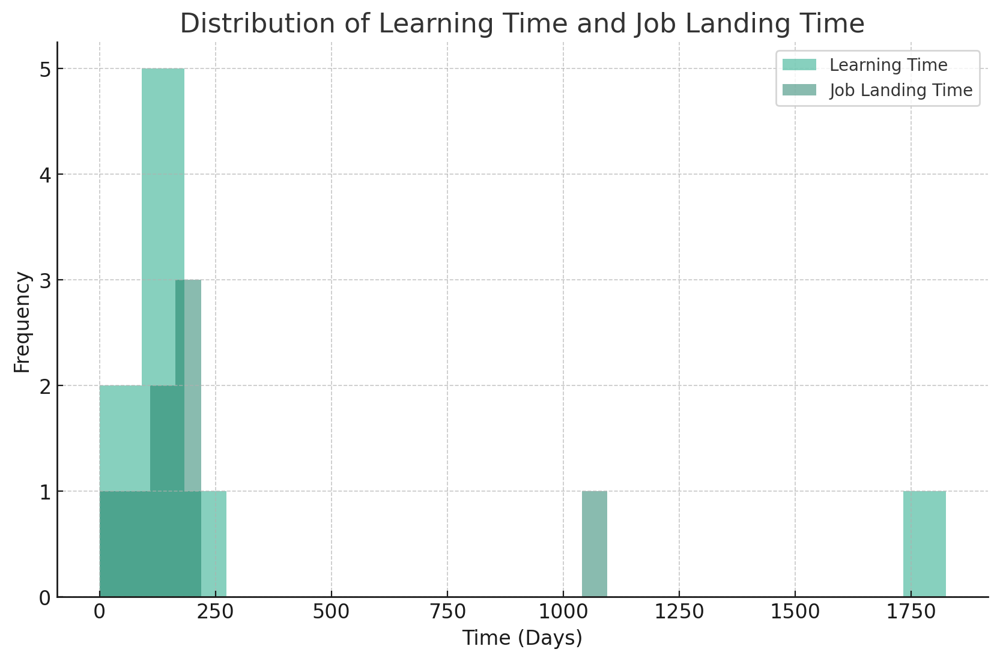
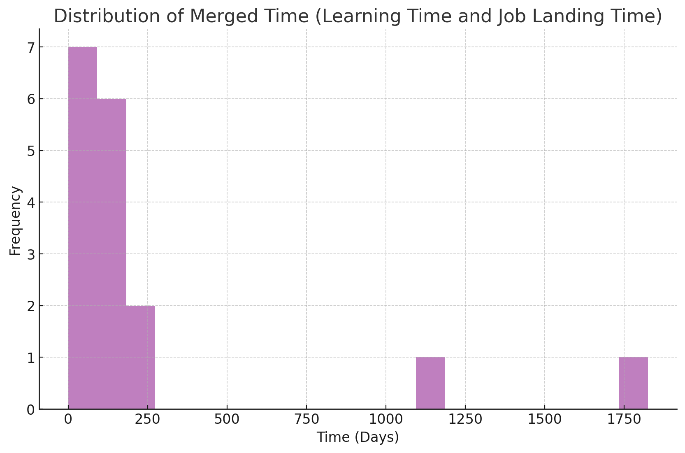
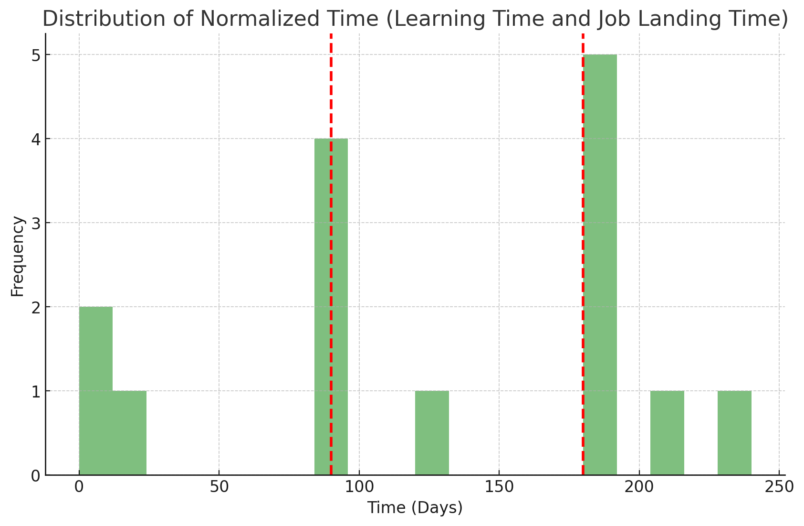

1. based on: https://twitter.com/hasan_3wada/status/1682416290684628992
2. see the youtube video at: [TODO]

## Related Public GPT Chat Records:

1. Scraping the raw text: https://chat.openai.com/share/67cd13e3-2916-4e03-a5e5-ffeee451ae77
2. Partial clean: https://chat.openai.com/share/d0d3e527-574b-4ade-9248-607a2684a01d
3. Cleaner data and viz: https://chat.openai.com/share/be297977-7add-41ad-8aec-d9852abd855a
4. Second pass with rescraped thread text: https://chat.openai.com/share/df755e01-51c1-4f76-8adb-8b3e03656995

## snapshot collection notes

I defined an empty array called snapofsnaps, scrolled twitter to activate virtual scrolling, and periodically ran `snapofsnaps.push([...document.querySelectorAll('article[data-testid=tweet]')].map(el => el.innerText))`

snapreader.py validates that every snap partially overlaps with the prior, so we know that there is an unbroken chain and no tweets are missed. then, the tweets are deduplicated and the array is flattened for further processing

`flat-json-to-user_responses.py` then writes the user_responses.csv used for viz

## summary results

Here's an initial histogram of the distributions of learning time and job landing time:

The p-value for a difference in means test between learning time in days and job landing time in days is 0.778, which is insignificant. I fail to reject the null hypothesis that these response groups follow an equivalent distribution. The Merged Time column is generated by merging these two response groups. Notice that some far-right outliers remain in the histogram below:

I calculated a final and preferred normalized response group from the merged group after removal of these far-right outliers, giving us the following final histogram in which the 25th and 75th percentile are specially demarkated for reference:

The following table of descriptive statistics is a useful aid to understanding the data in addition to the prior graphs:

| Statistic | Learning Time (days) | Job Landing Time (days) | Merged Time (days) | Normalized Time (days) |
| --------- | -------------------- | ----------------------- | ------------------ | ---------------------- |
| Count     | 9                    | 8                       | 17                 | 15                     |
| Mean      | 311                  | 245.625                 | 280.24             | 122.93                 |
| Std       | 573.51               | 349.67                  | 468.06             | 77.46                  |
| Min       | 0                    | 0                       | 0                  | 0                      |
| 10%       | 11.2                 | 63                      | 8.4                | 5.6                    |
| 25% (Q1)  | 90                   | 90                      | 90                 | 90                     |
| Median    | 180                  | 150                     | 180                | 120                    |
| 75% (Q3)  | 180                  | 187.5                   | 180                | 180                    |
| 90%       | 557                  | 475.5                   | 582                | 198                    |
| Max       | 1825                 | 1095                    | 1825               | 240                    |

Please note, there is a ton of missing nuance that will be readable in the thread itself eg language and motivational complications, sarcastic or humorous answers, etc. Also, many samples simply couldn't be easily parsed so you can get more samples by manually reviewing the thread and compiling a CSV by hand. This project was in part to check GPT-4 code compiler efficacy at this task (it wasn't very effective imo).
